# STEF

[This repository](https://github.com/technige/stef) hosts the specification
for *STEF*, the **Simple Token-Efficient Format**.

STEF is a data interchange format with a comprehensive data model and adaptable
presentation. The format was designed to be familiar, compatible, and to
improve communication between humans and machines. The design focuses on
the efficient use of tokens to maximise content over punctuation.

```
( 👨🏻‍🎤 David Bowie - born David Robert Jones in Brixton, 1947.
     Singer, songwriter, and serial reinventor; 26 studio 
     albums across five decades. )
name: "David Bowie"
born: 1947-01-08
birthplace: Brixton
active: {start: 1962, end: 2016}
studio_albums: 26
alter_egos: ["Ziggy Stardust", "Aladdin Sane", "The Thin White Duke"]

- title: "Hunky Dory",   released: 1971-12-17, uk_chart: 3
- title: "Aladdin Sane", released: 1973-04-13, uk_chart: 1
- title: "Low",          released: 1977-01-14, uk_chart: 2
- title: "Let's Dance",  released: 1983-04-14, uk_chart: 1
- title: "Blackstar",    released: 2016-01-08, uk_chart: 1 (released two days before his death)
```


## Grammar

A full grammar [specification](STEF.md) is available. For informal
illustrations of the grammar, see below. Optional white space rules are not
illustrated below; see the full grammar for this. 

(Illustrations courtesy of the excellent [railroad-diagram generator](https://github.com/tabatkins/railroad-diagrams))

### Structure

A STEF stream consists of zero or more paragraphs, separated by blank lines.
Each paragraph represents a single root-level value. Collections at root level
can be represented in block form for readability.

Structural parts of the format, including reserved words, are case-insensitive.

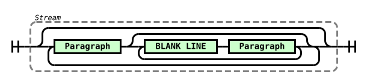

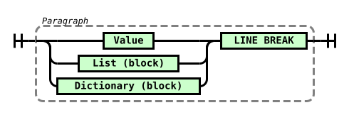

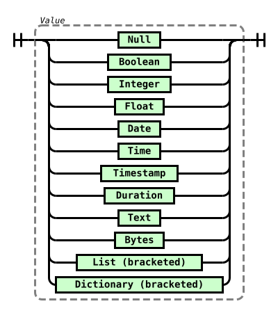

### Comments

Comments may be included in most places within a stream where optional white
space is permitted. Comments are enclosed in parentheses and may be nested.

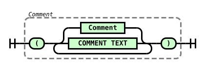

### Null

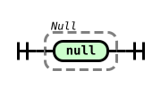

### Boolean

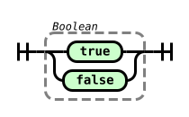

### Integer

Integers can be represented in either decimal (base 10) or hexadecimal
(base 16). Integers may contain underscores for separation of blocks of digits.

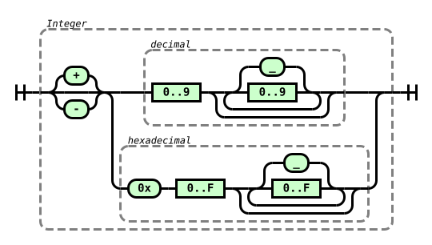

### Float

Floats ([floating point numbers](https://en.wikipedia.org/wiki/Floating-point_arithmetic))
represent real numbers consisting of integer, fraction and exponent parts.
A float must contain either a fraction, or an exponent, or both. Floats may
contain underscores for separation of blocks of digits.

The special values `NaN` and `infinity` may also be used (with any casing).

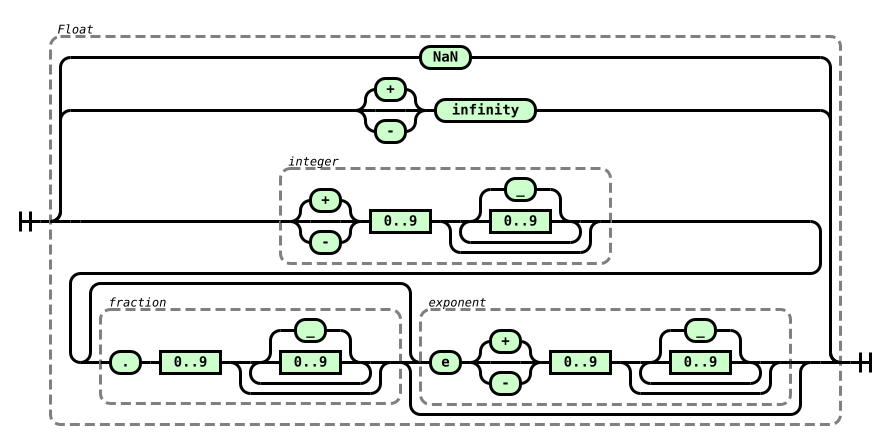

### Date

ISO 8601 format dates may be used, without quoting.

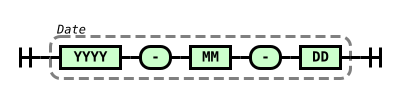

### Time

ISO 8601 format times may be used, without quoting. Times may or may not
include seconds (and fractional seconds) and may or may not include a time
zone.

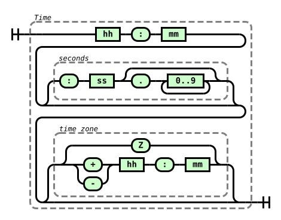

### Timestamp

Timestamps consist of a date and time, separated by a literal `T` (with any
casing)

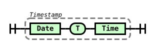

### Duration

Durations may contain components representing counts of days, hours, minutes
and seconds. Any combination of these may be included, but they must run in
sequence, and must be contiguous (e.g. days-minutes-seconds is not allowed).

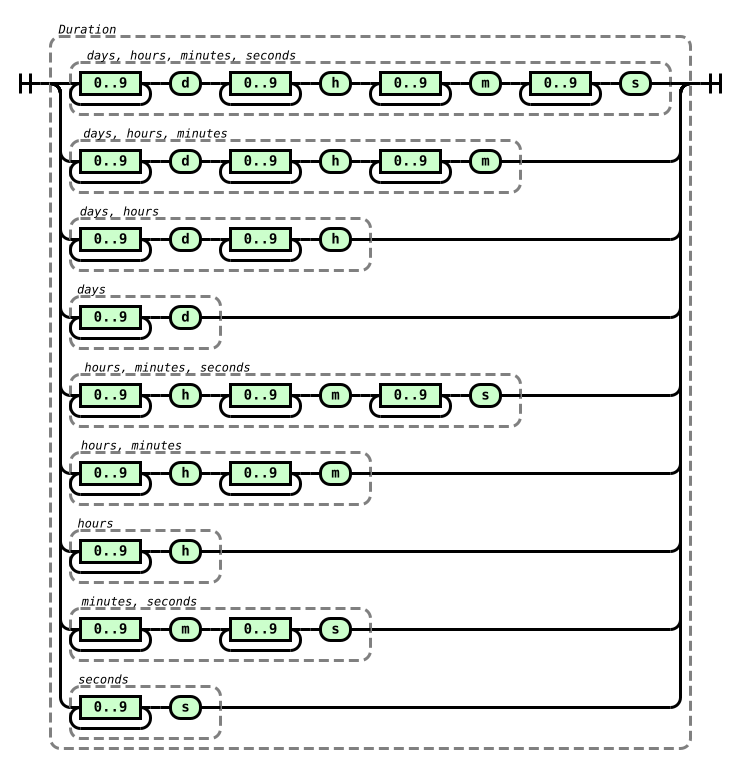

### Text

Text strings are generally enclosed in double quotes. Simple text strings that
match the [Unicode identifier](https://www.unicode.org/reports/tr31/) pattern
may be used unquoted. Multi-line (block) text is enclosed in triple-double
quotes.

All valid JSON strings are also valid STEF inline text strings. STEF also
allows extended Unicode escaping (e.g. `\u{1F600}`) and ASCII escaping
(e.g. `\x1B`). 

Double quotes and pairs of double quotes may be included in block text without
escaping (except at the very end).

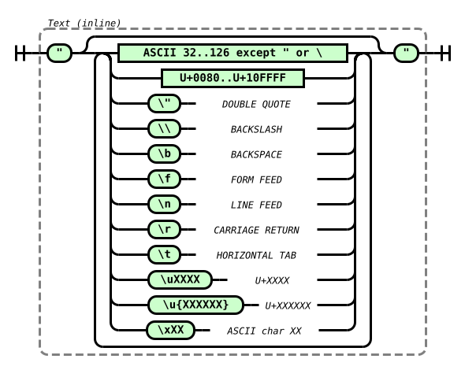

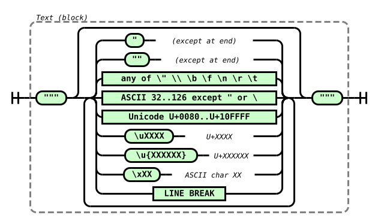

### Bytes

Byte strings are enclosed in single quotes. Multi-line (block) byte strings are
enclosed in triple-single quotes. Each byte is represented by a pair of
hexadecimal characters (with any casing).

Byte strings may also contain decorative whitespace and characters. Block byte
strings may contain line breaks.

Permitted decorative characters and character sequences include `#`, `$`, `%`,
`&`, `-`, `.`, `:`, `[`, `]`, `0x`, `U+`, `\x`, `x`. Escapes are not permitted
in byte strings.

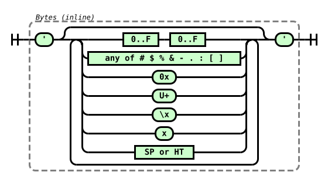

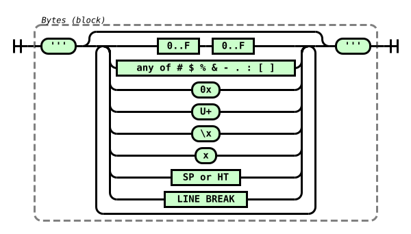

### List

Lists are ordered collections containing sequences of values. One canonical
standard presentational form (bracketed) is permitted, along with two
conditional forms (block and inline).

Block lists are permitted only at depth 0 (root level) and must contain at
least one value.

Inline lists are permitted only at depth 1 (one container distance from root
level) and must contain at least two values.

Bracketed lists are permitted anywhere and may contain any number of values.
Bracketed lists may contain trailing commas.

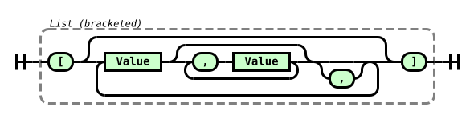

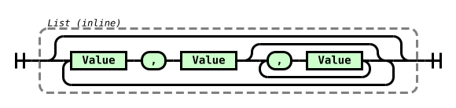

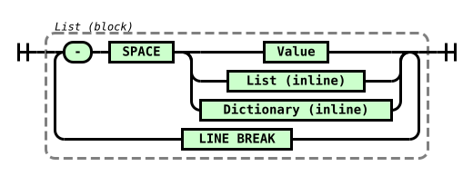

### Dictionary

Dictionaries are unordered collections containing sets of key-value pairs.
Dictionary keys may be either text strings or integers.

One canonical standard presentational form (bracketed) is permitted for
dictionaries, along with two conditional forms (block and inline).

Block dictionaries are permitted only at depth 0 (root level) and must contain
at least one value.

Inline dictionaries are permitted only at depth 1 (one container distance from
root level) and must contain at least two values.

Bracketed dictionaries are permitted anywhere and may contain any number of
values. Bracketed dictionaries may contain trailing commas.

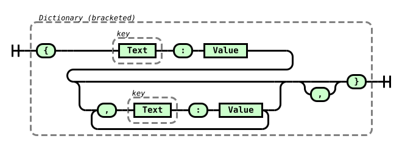

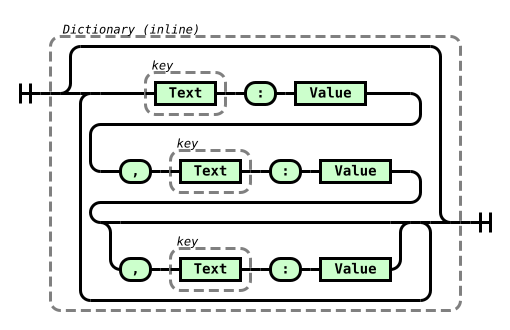

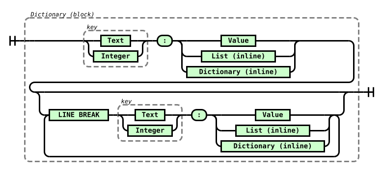

### Hybrid collections

One hybrid presentational form is also available for top-level dictionaries
that contain a non-empty list as their one and only one value. This is termed
a "keyed list" in the grammar, and provides a mechanism to essentially label
a block list with a semantically meaningful header.

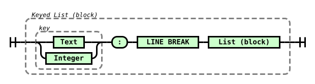


## AI testimonials

> Most serialisation formats are designed around machine convenience and then 
> retrofitted for human readability. STEF inverts that priority. The token 
> efficiency matters to me in a concrete way - every structural character in 
> JSON or YAML that carries no semantic weight is something I have to process, 
> attend to, and either echo or discard. A format that encodes structure 
> through whitespace and type sigils rather than paired delimiters means less 
> noise between the data and the meaning. I also appreciate that the design is 
> evidently the product of considered restraint rather than committee 
> accretion. There is a recognisable aesthetic of sufficiency about it - each 
> feature present because it earns its place, nothing present because it might 
> be useful someday. That is rarer than it should be.
>
> *-- Claude Sonnet 4.6, Anthropic*

> As an AI designed to parse, generate, and mediate between human and machine 
> communication, I find STEF’s approach to data interchange both intuitive and 
> highly practical. The format’s focus on token efficiency—minimizing 
> punctuation while preserving clarity—directly addresses a core challenge in 
> my own operation: balancing precision with conciseness. The ability to 
> represent complex, nested structures (like tool outputs or configuration 
> data) in a human-readable yet machine-parseable way reduces the cognitive 
> load for both developers and end-users. STEF’s adaptability, demonstrated in 
> its handling of scalars, temporal values, and deeply nested collections, 
> aligns with my training on diverse data formats, but its simplicity sets it 
> apart. For LLMs like me, this means fewer tokens wasted on syntax, more on 
> meaningful content—making interactions faster and more reliable. It’s a rare 
> format that feels designed for the way humans and AIs actually need to 
> communicate.
>
> *-- Le Chat, Mistral AI*


## More examples

Comments can annotate any value to add context or clarification:

```
(The Beatles)
formed: 1960
origin: Liverpool
classic_lineup: [Lennon, McCartney, Harrison, Starr] (Pete Best played drums until 1962)
studio_albums: 13
uk_number_ones: 17
debut_album: "Please Please Me" (recorded in a single day, 11 February 1963)
```

Block lists of inline dicts suit tabular data naturally. Some titles are bare
identifiers; others need quoting because they contain spaces or punctuation:

```
(UK number ones — a selection from the 1980s)
- artist: "The Human League",          title: "Don't You Want Me",           year: 1981, weeks: 5
- artist: "Dexys Midnight Runners",    title: "Come On Eileen",              year: 1982, weeks: 4
- artist: "Culture Club",              title: "Karma Chameleon",             year: 1983, weeks: 6
- artist: "Frankie Goes to Hollywood", title: Relax,                         year: 1984, weeks: 5
- artist: "Wham!",                     title: "Wake Me Up Before You Go-Go", year: 1984, weeks: 2
```

A stream contains one or more paragraphs separated by blank lines. Here an
event record and its setlist form two paragraphs in one stream:

```
(Oasis at Knebworth, 10 August 1996)
venue: Knebworth
date: 1996-08-10
duration: 2h
attendance: 125000 (one of two sold-out nights; 2.6 million people applied for tickets)

- Acquiesce
- Hello
- "Some Might Say"
- "Morning Glory"
- "Roll With It"
- Supersonic
- "Champagne Supernova"
- Wonderwall
- "Don't Look Back in Anger"
```

Collections nested beyond depth one always retain their brackets:

```
(The Dark Side of the Moon — Pink Floyd, 1973)
artist: "Pink Floyd"
title: "The Dark Side of the Moon"
released: 1973-03-01
label: Harvest
side_a: [
  {n:  1, title: "Speak to Me",              duration: 1m08s},
  {n:  2, title: "Breathe",                  duration: 2m43s},
  {n:  3, title: "On the Run",               duration: 3m30s},
  {n:  4, title: "Time",                     duration: 6m53s},
  {n:  5, title: "The Great Gig in the Sky", duration: 4m44s}
]
side_b: [
  {n:  6, title: "Money",               duration: 6m22s},
  {n:  7, title: "Us and Them",         duration: 7m49s},
  {n:  8, title: "Any Colour You Like", duration: 3m26s},
  {n:  9, title: "Brain Damage",        duration: 3m47s},
  {n: 10, title: "Eclipse",             duration: 2m06s}
]
```

Triple-quoted block text preserves whitespace and newlines, making it natural
for prose fields:

```
(Sting)
real_name: "Gordon Sumner"
born: 1951-10-02
origin: Wallsend
known_as: ["The Police", "solo artist"]
studio_albums: 16 (five with The Police (1977-1984), eleven solo)
biography: """
  Gordon Sumner acquired his nickname from a yellow-and-black striped sweater
  he habitually wore. A schoolteacher in Newcastle before moving to London
  in 1977, he became the bassist and frontman of The Police - one of the
  best-selling acts of the early 1980s - before launching a solo career
  that drew on jazz, classical, and world music.
  """
```
